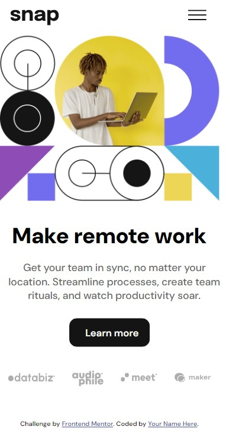

# Frontend Mentor - Intro section with dropdown navigation solution

This is a solution to the [Intro section with dropdown navigation challenge on Frontend Mentor](https://www.frontendmentor.io/challenges/intro-section-with-dropdown-navigation-ryaPetHE5). 

## Table of contents

- [Overview](#overview)
  - [The challenge](#the-challenge)
  - [Screenshot](#screenshot)
  - [Links](#links)
- [My process](#my-process)
  - [Built with](#built-with)
  - [What I learned](#what-i-learned)
  - [Continued development](#continued-development)
- [Author](#author)

**Note: Delete this note and update the table of contents based on what sections you keep.**

## Overview

### The challenge

Users should be able to:

- View the relevant dropdown menus on desktop and mobile when interacting with the navigation links
- View the optimal layout for the content depending on their device's screen size
- See hover states for all interactive elements on the page

### Screenshot





### Links

- Solution URL: [Add solution URL here](https://www.frontendmentor.io/solutions/introsectionwithdropdownnavigation-tfWSxCjeU4)
- Live Site URL: [Add live site URL here](https://cmp2007.github.io/intro-section-with-dropdown-navigation/)

## My process

### Built with

- Semantic HTML5 markup
- CSS custom properties
- Flexbox
- Mobile-first workflow

### What I learned

This is the first time that I use the "resize" event, I consider it to be a good lesson, as well as the first time that I establish a conditional with the measurements of the screen, for this reason, the elements that I learned to use in this practice seem particularly useful to me.

```js
function deleteNone() { //detect screen and relocate menu
    const windowOb = window;
    const windowValue = windowOb.innerWidth;
  
    if (windowValue > 930) {
      nav.classList.remove('none');
      nav.setAttribute('style', 'margin: 0 0%;');
    } else {
      nav.classList.add('none');
    }
  }

window.addEventListener('resize',deleteNone);
```

### Continued development

At this moment I want to continue doing challenges and practices based on HTML, CSS and JS to develop a good foundation before continuing with my learning path.


## Author

- Frontend Mentor - [CMP2007](https://www.frontendmentor.io/profile/CMP2007)