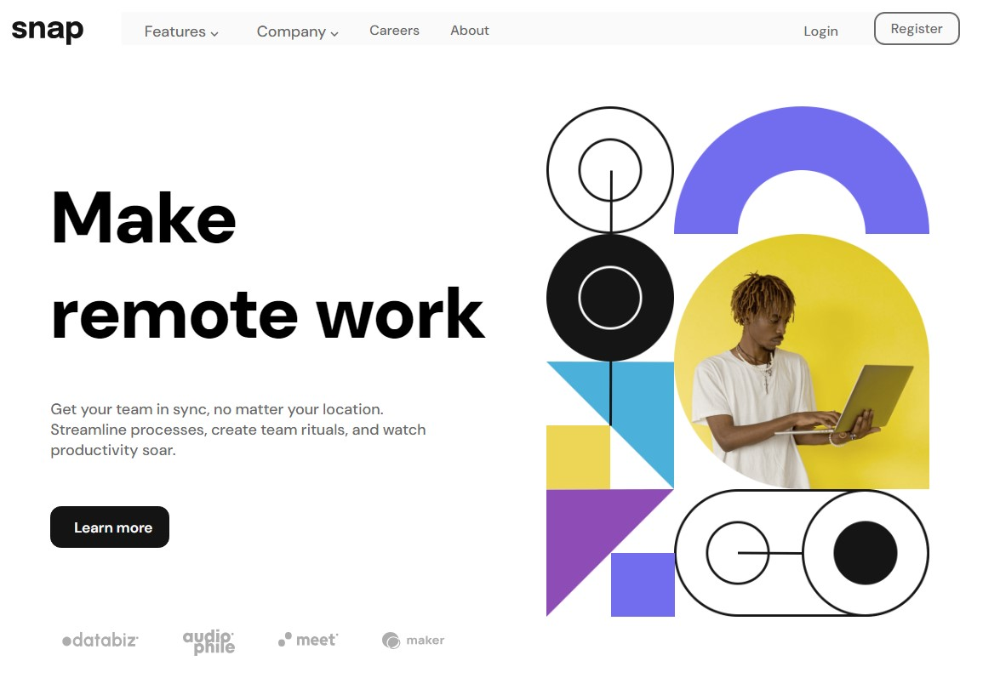

# Intro Section with Dropdown Navigation: Responsive Architecture

This project is a **historical practice** focused on mastering responsive navigation systems. It demonstrates the ability to implement a "Mobile-First" navigation that transforms from a slide-out sidebar (off-canvas) to a complex desktop header with interactive dropdown menus.

---

## 🚀 Demo
[SEE DEMO HERE](https://cmp2007.github.io/intro-section-with-dropdown-navigation/)

### 🏆 Challenge Context
This project was developed as a solution to the [Intro section with dropdown navigation challenge on Frontend Mentor](https://www.frontendmentor.io/solutions/introsectionwithdropdownnavigation-tfWSxCjeU4).

### Screenshot

---

## 📋 Evolution & Context Note
> ⚠️ **Note on my trajectory:** This repository reflects my exploration of responsive logic beyond simple Media Queries. By using the `window.onresize` event and manual DOM manipulation, I learned to synchronize layout states between mobile and desktop environments before adopting modern declarative frameworks.

## 📋 Technical Milestones of this Stage
In this specific phase of my training, I successfully achieved:

* **Hybrid Navigation System:** Implementation of an "Off-Canvas" mobile menu and a persistent desktop header, managed through a custom `deleteNone()` function that monitors screen width in real-time.
* **Synchronized State Transitions:** Use of `setTimeout` in JavaScript to coordinate CSS transitions with `display: none` logic, ensuring smooth slide-in and slide-out animations for the mobile overlay.

* **Interactive Disclosure Components:** Utilization of the semantic `
` and `
` HTML tags, enhanced with custom JavaScript to toggle arrow iconography based on the `open` attribute state.
* **Advanced Responsive Imagery:** Dynamic swapping of hero images (`mobile` vs `desktop`) using CSS `content` properties and Media Queries to optimize visual impact across devices.
* **Overlay Layering (Z-Index):** Management of complex visual hierarchies, including a semi-transparent background overlay (`.sec1`) that dims the main content when the mobile menu is active.

## 🛠️ Technologies (at the time)
* **HTML5:** Semantic navigation, `
` components, and custom SVG icons.
* **CSS3:** Flexbox layout, absolute positioning, and synchronized transitions.
* **Vanilla JavaScript:** Event listeners (Resize/Click), DOM attribute manipulation, and timing functions.

---
**Coded by [Carlos Miguel Puche](https://github.com/CMP2007)**
